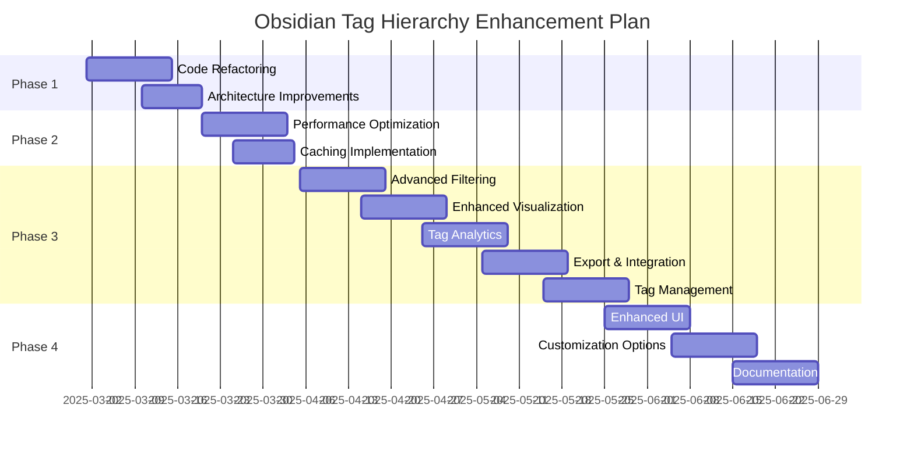

# Obsidian Tag Hierarchy Plugin Analysis

## Project Overview

The Obsidian Tag Hierarchy Plugin is designed to visualize and navigate through hierarchical tags in an Obsidian vault. It provides a tree-structured view of tags, displays tag counts, allows filtering by usage, and can generate a markdown file containing the tag hierarchy.

### Core Features
- Hierarchical tree view of tags in the Obsidian UI
- Tag count display showing how many notes use each tag
- Expandable/collapsible tag hierarchy levels
- Filtering tags by minimum usage count
- Markdown file generation with hierarchical tag structure
- Automatic update of the markdown file on startup
- Command to manually update the markdown file

## Architecture Analysis

The plugin follows the standard Obsidian plugin architecture with:

1. **Main Plugin Class (`TagHierarchyPlugin`)**: Handles plugin lifecycle, commands, and settings
2. **View Class (`TagHierarchyView`)**: Manages the UI representation of the tag hierarchy
3. **Settings Class (`TagHierarchySettingTab`)**: Provides configuration options

The code is well-structured and follows Obsidian's plugin development patterns. However, there are several areas for improvement:

### Strengths
- Clean separation of concerns between plugin, view, and settings
- Good use of Obsidian's API for tag retrieval and display
- Comprehensive settings for customization
- Proper event handling for UI interactions

### Areas for Improvement

1. **Code Organization**
   - The entire plugin is in a single file, which could become difficult to maintain as features grow
   - No separation between data model, view logic, and controller logic

2. **Error Handling**
   - Basic error handling exists but could be more robust
   - Some error messages are generic and don't provide specific guidance

3. **Performance Considerations**
   - No caching mechanism for tag data
   - Rebuilds the entire hierarchy on each refresh
   - Could be inefficient for large vaults with many tags

4. **User Experience**
   - Limited search/filter capabilities (only minimum count filtering)
   - No sorting options beyond alphabetical
   - No visual indicators for tag relationships beyond indentation

5. **Feature Gaps**
   - No way to exclude specific tags or tag patterns
   - No statistics or analytics about tag usage
   - Limited export options (only markdown)
   - No tag management capabilities (rename, merge, etc.)

## Enhancement Project Plan

Based on the analysis, here's a comprehensive plan to enhance the plugin:

### Phase 1: Code Refactoring and Architecture Improvements

1. **Modularize the codebase**
   - Split into multiple files (model, view, controller pattern)
   - Create dedicated modules for:
     - Tag data management
     - UI rendering
     - File operations
     - Settings management

2. **Improve data structures**
   - Create proper TypeScript interfaces for all data structures
   - Implement a more efficient tag hierarchy model
   - Add caching for better performance

3. **Enhance error handling**
   - Implement comprehensive error handling
   - Provide user-friendly error messages
   - Add logging for debugging

### Phase 2: Performance Optimization

1. **Implement efficient data processing**
   - Add incremental updates instead of rebuilding the entire hierarchy
   - Optimize tag counting algorithm
   - Implement lazy loading for large tag hierarchies

2. **Add caching mechanisms**
   - Cache tag data to reduce processing time
   - Implement smart refresh that only updates changed tags
   - Add background processing for large operations

### Phase 3: Feature Enhancements

1. **Advanced filtering and sorting**
   - Add search functionality within the tag hierarchy
   - Implement multiple sorting options (by count, alphabetical, recently used)
   - Add tag exclusion patterns
   - Implement tag grouping options

2. **Enhanced visualization**
   - Add visual indicators for tag relationships
   - Implement color coding based on tag usage
   - Add compact/expanded view options
   - Provide alternative visualization modes (e.g., mind map, network graph)

3. **Tag analytics**
   - Add statistics about tag usage
   - Show trends over time
   - Identify orphaned or rarely used tags
   - Suggest tag consolidation opportunities

4. **Export and integration**
   - Add multiple export formats (CSV, JSON, HTML)
   - Implement copy to clipboard functionality
   - Add integration with other plugins (e.g., Dataview)
   - Provide API for other plugins to access tag hierarchy data

5. **Tag management**
   - Add ability to rename tags across the vault
   - Implement tag merging functionality
   - Add bulk tag operations
   - Provide tag suggestions based on content

### Phase 4: User Experience Improvements

1. **Enhanced UI**
   - Implement drag-and-drop for tag reorganization
   - Add context menus for tag operations
   - Improve accessibility features
   - Add keyboard shortcuts for common operations

2. **Customization options**
   - Add theming support
   - Implement custom tag icons
   - Provide layout customization
   - Add user-defined tag categories

3. **Documentation and onboarding**
   - Create comprehensive documentation
   - Add interactive tutorials
   - Implement tooltips and help indicators
   - Provide example use cases

## Implementation Timeline



## Specific Technical Improvements

Here are specific technical improvements that could be implemented:

1. **Create a proper tag data model**
```typescript
// In models/TagModel.ts
export interface TagNode {
    name: string;
    path: string;
    count: number;
    children: Map<string, TagNode>;
    parent: TagNode | null;
}

export class TagHierarchyModel {
    private rootTags: Map<string, TagNode> = new Map();
    private tagCache: Map<string, TagNode> = new Map();

    // Methods for building and accessing the hierarchy
    buildHierarchy(allTags: Record<string, number>): void { /* ... */ }
    getTagByPath(path: string): TagNode | undefined { /* ... */ }
    // etc.
}
```

2. **Implement a tag service for data operations**
```typescript
// In services/TagService.ts
export class TagService {
    private app: App;
    private model: TagHierarchyModel;

    constructor(app: App) {
        this.app = app;
        this.model = new TagHierarchyModel();
    }

    async refreshTagData(): Promise<void> { /* ... */ }
    async generateMarkdownFile(path: string): Promise<void> { /* ... */ }
    searchTags(query: string): TagNode[] { /* ... */ }
    // etc.
}
```

3. **Create a dedicated view renderer**
```typescript
// In views/TagHierarchyRenderer.ts
export class TagHierarchyRenderer {
    private containerEl: HTMLElement;
    private model: TagHierarchyModel;
    private settings: TagHierarchySettings;

    constructor(containerEl: HTMLElement, model: TagHierarchyModel, settings: TagHierarchySettings) {
        this.containerEl = containerEl;
        this.model = model;
        this.settings = settings;
    }

    render(): void { /* ... */ }
    renderTagNode(node: TagNode, container: HTMLElement, level: number): void { /* ... */ }
    // etc.
}
